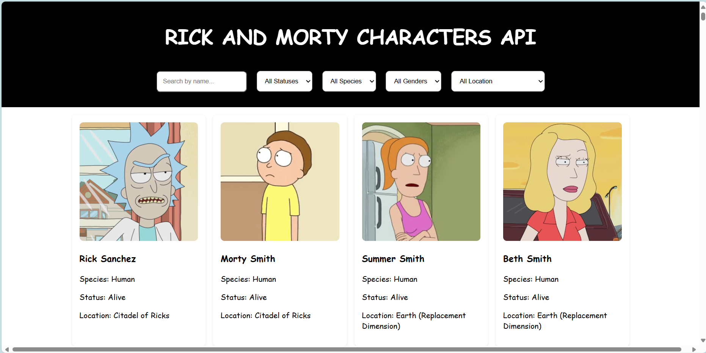
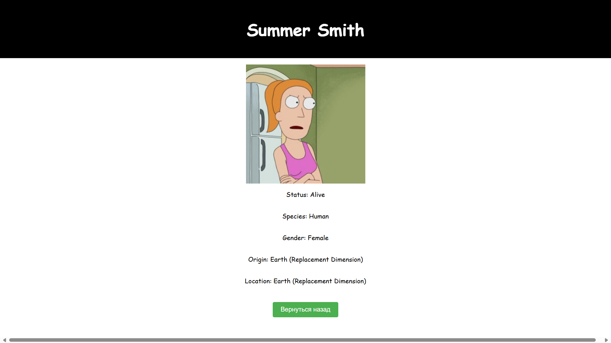

# Rick and Morty Characters

Этот проект создан с использование Rick and Morty API для отображения персонажей из одноименного сериала. 
Пользователи данного сайта могут искать персонажей по имени, фильтровать по статусу, виду, полу и месту нахождения. Также реализована постраничная пагинация для загрузки всех персонажей, что ускоряет загрузку.

## Особенности проекта

- **Поиск по имени:** Введите имя персонажа для фильтрации результатов.
- **Фильтр по статусу:** Выберите из "Dead", "Alive" или "unknown".
- **Фильтр по виду:** Выберите доступные виды, такие как "Human", "Aliev".
- **Фильтр по полу:** Фильтрация по "Male", "Female", "Genderless" или "unknown".
- **Фильтр по месту происхождения:** Фильтрация персонажей по их месту происхождения (например, "Earth").

## Взаимодействие со страницей:

   - Используйте поле поиска для фильтрации персонажей по имени.
   - Используйте выпадающие списки для фильтрации персонажей по статусу, виду, полу и месту происхождения.
   - Персонажи будут динамически обновляться в соответствии с выбранными фильтрами.
   - При клике на иконку персонажа открывается страница с подробной информацией о персонаже.
   - На этой странице под всей информацией находится кнопка для возврата к предыдущей странице, чтобы продолжить просмотр других персонажей.

## Визуал страницы:
### Первоначальная страница:

---
### Страница с дополнительной информацией

--- 

### Постраничная пагинация

## Использованные технологии

- HTML
- CSS 
- JavaScript 
- API: [The Rick and Morty API](https://rickandmortyapi.com/documentation)

